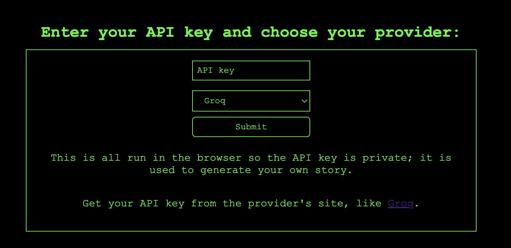
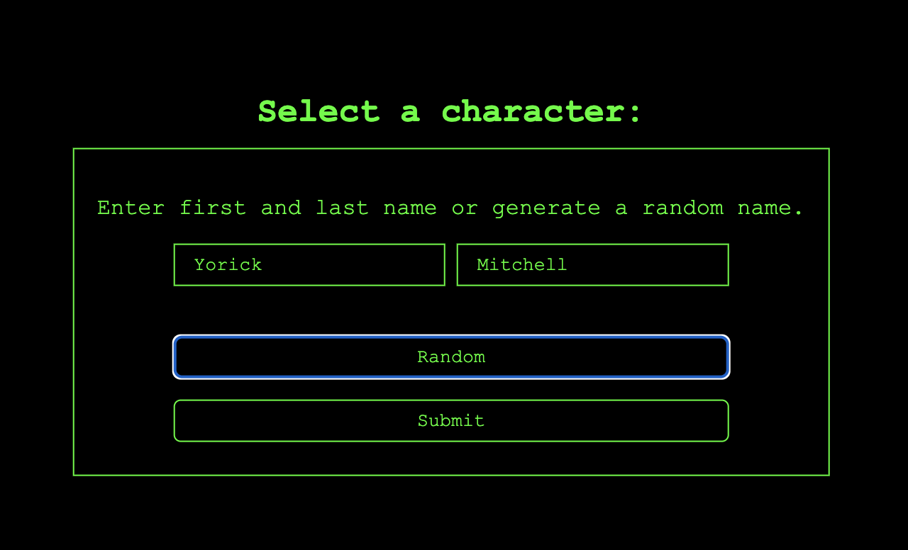
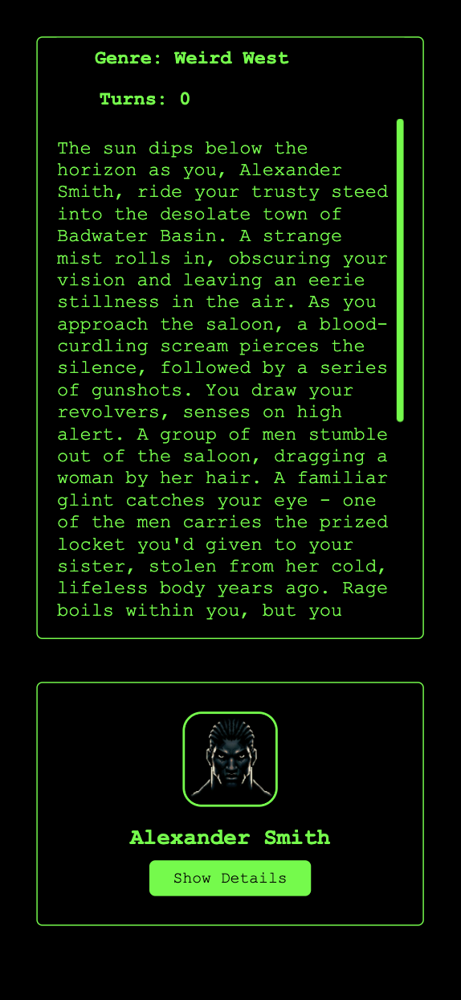

# MyTextAdventure :video_game:

<p align="center">
  
</p>

[](https://opensource.org/licenses/MIT)
[](https://reactjs.org)
[](https://www.typescriptlang.org)
[](https://developer.mozilla.org/en-US/docs/Web/CSS)

MyTextAdventure is an interactive, procedurally generated text adventure game powered by the OpenAI API. Choose your favorite genre and dive into an immersive world created just for you! Our advanced prompt engineering ensures that GPT responses are intelligently formatted and integrated into your unique adventure.

A link to it up and running: https://llm-text-adventure.surge.sh/
Please be aware you will need to create an account with OpenAI for gain an API key to use this app.

## Table of Contents

- [Features](#features)
- [Screenshots](#screenshots)
- [Installation](#installation)
- [Usage](#usage)
- [License](#license)

## Features

- Interactive, procedurally generated text adventures
- Choose from multiple genres
- Powered by OpenAI API
- Advanced prompt engineering for intelligent GPT responses
- React, TypeScript, and CSS-based responsive design

## Screenshots

<p align="center">
  
  
  
  
  
  
  
  
</p>

## Installation

1. Clone the repository

```bash
git clone https://github.com/yourusername/mytextadventure.git
```

2. Install dependencies

```bash
npm install
```

## Usage

1. Start the development server

```bash
npm start
```

2. Navigate to `localhost:3000` in your browser

## License

This project is licensed under the terms of the MIT license.
